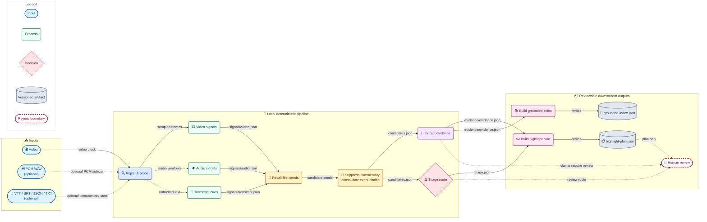
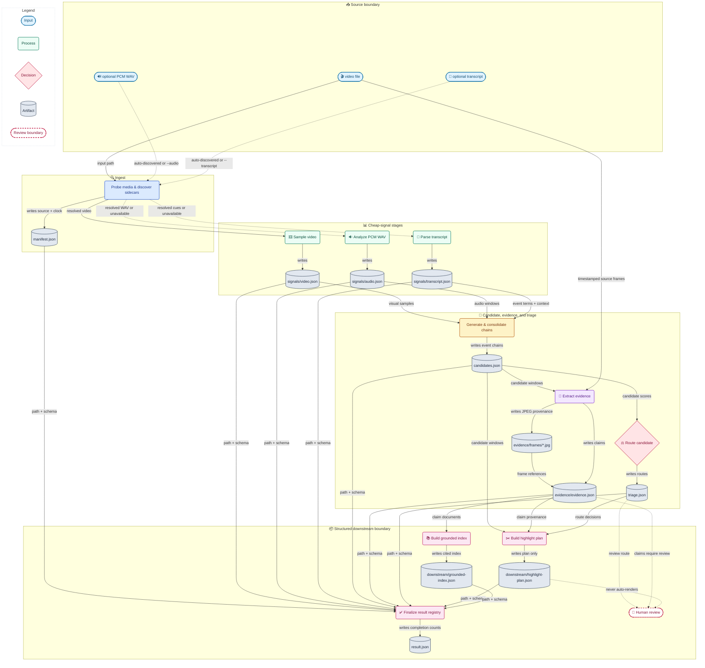
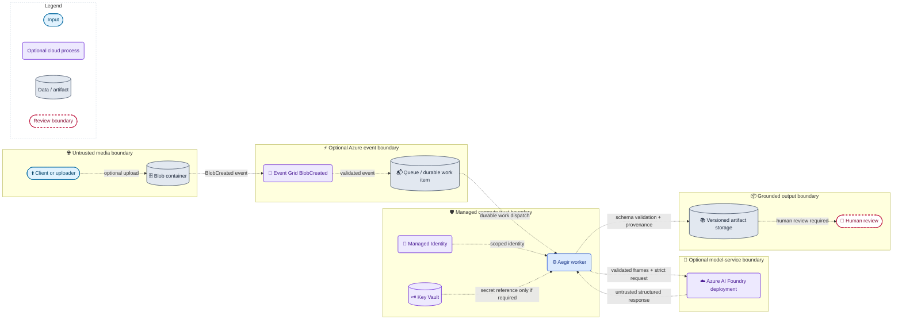

# Mimir Aegir

Mimir Aegir is an exploratory, local-first Python proof of concept for staged
multimodal media intelligence. It turns a video plus optional audio and
transcript sidecars into inspectable signals, recall-first candidate event
chains, provenance-bearing evidence, deterministic triage decisions, and
reviewable downstream artifacts.

This repository is **not a production system**. The default path makes no
network calls, needs no credentials or private media, and does not claim to
understand an event semantically. Every retained claim is marked for human
review.

> Licensing is pending ownership and publication-authorization review. No
> license is granted by this repository.

## Project at a glance

| Surface | Status | Behavior |
| --- | --- | --- |
| Ingest and probe | Implemented locally | Validates the video and records OpenCV timing assumptions |
| Video cheap signals | Implemented locally | Samples brightness, sharpness, and adjacent-frame motion |
| Audio cheap signals | Implemented locally | Reads an optional 16-bit PCM WAV sidecar |
| Transcript signals | Implemented locally | Reads VTT, SRT, cue-list JSON, or plain text sidecars |
| Candidate generation | Implemented locally | Recall-first seeds followed by event-chain consolidation |
| Commentary/offside handling | Implemented locally | Suppresses unsupported transcript-only commentary; treats `offside` as context, not direct event proof |
| Evidence and cascade | Implemented locally | Extracts timestamped frames, preserves source references, and routes to keep/drop/human review |
| Highlight foundation | Implemented locally | Writes a reviewable edit-decision plan only |
| Grounded QA foundation | Implemented as a library | Builds a claim index and withholds answers without lexical evidence |
| Azure/Foundry | Optional adapter | Strict Responses API enrichment and Event Grid validation; never invoked by the default command |
| Rendering | Not implemented | No FFmpeg render or publish step is claimed |
| Replay/aftermath packaging | Not solved | Context is preserved, but packaging logic is deliberately absent |
| Skill screening | Excluded | The historical domain-specific path depended on semantic/model evidence that this clean local package does not reproduce |
| Reviewer automation | Explicitly excluded | No reviewer workflow, prompt, runner, environment example, or report is included or executed |

The implemented local path is:

`video + optional sidecars -> cheap signals -> recall-first event chains -> evidence -> triage -> review artifacts`

The signal scores are deterministic heuristics, not semantic confidence or
event probabilities. Start locally with authorized user media; keep the
optional Azure adapter separate until the local contracts are understood.

## Clone, install, add your video, run one command

Prerequisites are Python 3.11 or newer, `pip`, and a platform with a wheel for
the pinned `opencv-python-headless` version.

```bash
git clone https://github.com/williamsuchun/Mimir-Aegir.git
cd Mimir-Aegir
python3 -m venv .venv
source .venv/bin/activate
python -m pip install -r requirements.txt
cp /path/to/your-video.mp4 input.mp4
python -m mimir_aegir run \
  --config configs/default.toml \
  --input input.mp4 \
  --output output/my-run
```

Video-only input is valid. To include audio evidence, add a 16-bit PCM
`input.wav` beside the video or pass `--audio`; embedded MP4 audio is not
extracted by the base installation. The user-media command executes every
local stage and prints the result path followed by input-dependent route
counts.

Assert the documented artifact paths and versioned schemas without extra
tools:

```bash
python - <<'PY'
import json
from pathlib import Path

root = Path("output/my-run")
expected = {
    "manifest.json": "mimir.aegir.manifest.v1",
    "signals/video.json": "mimir.aegir.video-signals.v1",
    "signals/audio.json": "mimir.aegir.audio-signals.v1",
    "signals/transcript.json": "mimir.aegir.transcript-signals.v1",
    "candidates.json": "mimir.aegir.candidates.v1",
    "evidence/evidence.json": "mimir.aegir.evidence.v1",
    "triage.json": "mimir.aegir.triage.v1",
    "downstream/highlight-plan.json": "mimir.aegir.highlight-plan.v1",
    "downstream/grounded-index.json": "mimir.aegir.grounded-index.v1",
    "result.json": "mimir.aegir.result.v1",
}
documents = {
    path: json.loads((root / path).read_text())
    for path in expected
}

assert all(documents[path]["schema_version"] == schema for path, schema in expected.items())
assert documents["result.json"]["run_status"] == "completed"
assert documents["result.json"]["source_file"] == "input.mp4"
assert documents["candidates.json"]["strategy"] == "recall_first_event_chains"
assert documents["downstream/highlight-plan.json"]["render_status"] == "plan_only"
assert {
    item["path"]: item["schema_version"]
    for item in documents["result.json"]["artifacts"]
} == {path: schema for path, schema in expected.items() if path != "result.json"}
assert all(
    claim["human_review_required"]
    for claim in documents["evidence/evidence.json"]["claims"]
)
print("Aegir user-media artifacts match the documented contracts.")
PY
```

### No-video deterministic fallback

When no authorized video is available, generate the built-in six-second
MP4/WAV/VTT fixture and execute the same local stages:

```bash
python -m mimir_aegir run \
  --config configs/default.toml \
  --demo \
  --output output/demo
```

Success prints exactly:

```text
output/demo/result.json
candidates=2 keep=1 review=0 drop=1
```

Inspect and assert the important boundaries without extra tools:

```bash
python - <<'PY'
import json
from pathlib import Path

root = Path("output/demo")
result = json.loads((root / "result.json").read_text())
candidates = json.loads((root / "candidates.json").read_text())
plan = json.loads((root / "downstream/highlight-plan.json").read_text())

assert result["run_status"] == "completed"
assert (result["candidate_count"], result["kept_count"], result["dropped_count"]) == (2, 1, 1)
assert candidates["strategy"] == "recall_first_event_chains"
assert candidates["candidates"][1]["context"] == ["offside"]
assert candidates["candidates"][1]["commentary_only_suppressed"] is True
assert plan["render_status"] == "plan_only"
assert all(clip["review_status"] in {"ready_for_review", "requires_review"} for clip in plan["clips"])
print("Aegir demo artifacts match the documented contracts.")
PY

python -m unittest discover -s tests -p 'test_*.py' -v
python -m compileall -q mimir_aegir tests
```

Expected assertion output is `Aegir demo artifacts match the documented
contracts.` followed by ten passing tests. The compile command is silent on
success.

Read next:

1. [Architecture](docs/ARCHITECTURE.md) for stage ownership, contracts, and safe
   extension patterns.
2. [Contributing](CONTRIBUTING.md) for the smallest safe change workflow and
   fixture policy.
3. [Next steps](docs/NEXT_STEPS.md) for code-grounded priorities and explicit
   gaps.
4. [Agent instructions](AGENTS.md) for concise repository guardrails.

## Logical workflow



The transcript path is intentionally subordinate to non-text evidence.
Transcript event terms can improve recall, but transcript-only commentary is
suppressed. Context terms such as `offside`, `replay`, and `aftermath` are
preserved without independently creating a high-priority highlight.

Pinned base packages are `numpy==2.2.6`,
`opencv-python-headless==4.12.0.88`, and `pydantic==2.11.7`. The clean local
path does not require FFmpeg, Azure, model weights, secrets, or network access
after installation.

## Run user media

Video-only input is valid. Missing optional modalities produce explicit
`available: false` signal artifacts rather than fabricated data.

```bash
python -m mimir_aegir run \
  --config configs/default.toml \
  --input /path/to/input.mp4 \
  --output output/my-run
```

To add local audio and transcript evidence:

```bash
python -m mimir_aegir run \
  --config configs/default.toml \
  --input /path/to/input.mp4 \
  --audio /path/to/input.wav \
  --transcript /path/to/input.vtt \
  --output output/my-run
```

When explicit sidecar arguments are omitted, `input.wav` and then
`input.vtt`, `input.srt`, `input.json`, or `input.txt` are auto-discovered
beside `input.mp4`. The WAV reader accepts 16-bit PCM only. JSON transcripts
must be a list of objects with `start_sec`, `end_sec`, and `text`.

## Configuration and environment

`configs/default.toml` is validated with Pydantic using `extra="forbid"`.
Unknown fields, unsupported schema versions, non-finite intervals, and invalid
threshold ordering fail before processing.

```toml
schema_version = "mimir.aegir.config.v1"

[video]
sample_interval_sec = 0.5
analysis_width = 160

[audio]
window_sec = 0.5

[candidates]
window_sec = 2.5
minimum_score = 0.16
chain_gap_sec = 1.25
maximum_candidates = 12

[triage]
keep_score = 0.55
drop_score = 0.12
minimum_supporting_modalities = 2

[output]
extract_evidence_frames = true
maximum_evidence_frames_per_candidate = 3
```

The default local runtime consumes **no environment variables**. It does not
silently look for cloud credentials. Install the optional identity and
inference packages only when explicitly using `mimir_aegir.azure`:

```bash
python -m pip install '.[azure]'
```

That extra does not enable cloud inference by itself. The optional adapter
requires explicit `AZURE_OPENAI_ENDPOINT`, `AZURE_OPENAI_DEPLOYMENT`, and
`AZURE_OPENAI_REGION` values, uses the OpenAI `/openai/v1/` Responses surface,
and obtains an Entra token through `DefaultAzureCredential`. Its parsed output
must cite existing local claim ids and remains human-review-required. The
adapter was reconstructed from the retained generic client path and checked
against the Microsoft Foundry Responses documentation; it is not exercised
against a deployment in this repository. Prefer Managed Identity and Key
Vault; never commit credentials or connection strings.

## Local DAG and artifacts



The output directory is an explicit stage boundary:

```text
output/demo/
├── input/
│   ├── synthetic.mp4
│   ├── synthetic.wav
│   └── synthetic.vtt
├── manifest.json
├── signals/
│   ├── video.json
│   ├── audio.json
│   └── transcript.json
├── candidates.json
├── evidence/
│   ├── evidence.json
│   └── frames/
│       ├── candidate-001-01.jpg
│       ├── candidate-001-02.jpg
│       └── candidate-001-03.jpg
├── triage.json
├── downstream/
│   ├── highlight-plan.json
│   └── grounded-index.json
└── result.json
```

Each JSON document has its own `schema_version`. `result.json` references the
stage artifacts instead of embedding them:

```json
{
  "schema_version": "mimir.aegir.result.v1",
  "run_status": "completed",
  "source_file": "synthetic.mp4",
  "candidate_count": 2,
  "kept_count": 1,
  "review_count": 0,
  "dropped_count": 1,
  "artifacts": [
    {
      "stage": "ingest",
      "path": "manifest.json",
      "schema_version": "mimir.aegir.manifest.v1"
    },
    {
      "stage": "video_signals",
      "path": "signals/video.json",
      "schema_version": "mimir.aegir.video-signals.v1"
    },
    {
      "stage": "audio_signals",
      "path": "signals/audio.json",
      "schema_version": "mimir.aegir.audio-signals.v1"
    },
    {
      "stage": "transcript_signals",
      "path": "signals/transcript.json",
      "schema_version": "mimir.aegir.transcript-signals.v1"
    },
    {
      "stage": "candidates",
      "path": "candidates.json",
      "schema_version": "mimir.aegir.candidates.v1"
    },
    {
      "stage": "evidence",
      "path": "evidence/evidence.json",
      "schema_version": "mimir.aegir.evidence.v1"
    },
    {
      "stage": "triage",
      "path": "triage.json",
      "schema_version": "mimir.aegir.triage.v1"
    },
    {
      "stage": "highlight_plan",
      "path": "downstream/highlight-plan.json",
      "schema_version": "mimir.aegir.highlight-plan.v1"
    },
    {
      "stage": "grounded_index",
      "path": "downstream/grounded-index.json",
      "schema_version": "mimir.aegir.grounded-index.v1"
    }
  ],
  "limitations": [
    "Local cheap signals propose review candidates; they do not establish event semantics.",
    "All retained evidence requires human review.",
    "Replay and aftermath packaging are not solved."
  ]
}
```

## Repository layout

```text
configs/default.toml          strict default pipeline configuration
mimir_aegir/
  artifacts.py                atomic JSON artifact writer
  azure.py                    optional Foundry Responses and Event Grid boundaries
  candidates.py               recall-first seeds and event-chain consolidation
  cli.py                      single `run` command
  config.py                   strict TOML configuration schemas
  demo.py                     deterministic synthetic video/WAV/VTT bundle
  downstream.py               highlight plan and grounded QA foundations
  evidence.py                 timestamped visual evidence and claims
  ingest.py                   media probe and sidecar discovery
  models.py                   versioned Pydantic artifact contracts
  pipeline.py                 stage orchestration
  signals.py                  video/audio/transcript cheap signals
  triage.py                   deterministic cascade boundaries
tests/test_pipeline.py        offline unit and end-to-end contract tests
.github/workflows/tests.yml   clean GitHub Actions demo/test/compile path
```

## Optional Azure topology

The following is a target integration boundary, not deployed infrastructure.
The local artifact contracts remain the source of truth. Azure resources and
model calls incur cost and require an explicit implementation and validation
round before use.



Use an Event Grid-based `BlobCreated` flow rather than a legacy polling blob
trigger. Restrict identities and storage scopes, validate event subject and
content type, and treat model responses as untrusted until strict schema and
provenance checks pass. Any use involving faces, biometrics, customer media,
or personal data requires human privacy/compliance review. Delete temporary
media and tear down demo resources after validation to stop ongoing storage,
compute, and model costs.

## Grounding, confidence, and review

- Candidate scores are bounded local fusion scores, not calibrated event
  probabilities.
- Evidence claims identify the deterministic basis for their confidence and
  include artifact, timestamp, frame, or cue provenance.
- The cascade can drop unsupported commentary, retain strongly supported
  multimodal candidates, or hold ambiguous candidates for review.
- `answer_grounded_question()` returns a cited indexed statement or a
  `withheld_reason`; it does not improvise missing facts.
- The highlight artifact is a plan for review. It does not auto-render,
  auto-publish, or imply editorial correctness.

## Tests

```bash
python -m unittest discover -s tests -p 'test_*.py' -v
python -m compileall -q mimir_aegir tests
```

The suite covers the exact demo CLI, strict config rejection, staged artifact
contracts, provenance, transcript-only `offside` suppression, missing input,
and grounded-QA withholding.

## Privacy, security, and cost

- Input media, sidecars, generated frames, artifacts, `.env` files, and common
  media extensions are ignored by Git.
- No private media, corpus, labels, judgments, evaluation reports, metrics,
  telemetry, fingerprints, or cloud identifiers are tracked.
- Do not hardcode tokens, keys, endpoints, account names, deployment names, or
  connection strings.
- Prefer local validation. Cloud inference and long-lived Azure resources can
  create ongoing cost; set budgets and tear down proof-of-concept resources.
- Low-confidence or malformed outputs must remain reviewable or fail closed.
- Human review is a product safety boundary, not the development-review
  automation that is intentionally excluded from this repository.

## Troubleshooting

### OpenCV cannot open the input

Confirm the file exists and uses a codec supported by the installed OpenCV
build. Transcode outside Aegir if necessary; the CLI does not hide a
transcoding dependency.

### The audio artifact says unavailable

Provide `--audio` with a 16-bit PCM WAV or place a same-stem `.wav` beside the
video. Embedded MP4 audio is not extracted by the base installation.

### The transcript has no useful cues

Prefer timestamped VTT, SRT, or cue-list JSON. Plain text has no reliable
timeline and is therefore weak context.

### Everything routes to human review or drop

Inspect the three signal artifacts and `candidates.json` before tuning one
configuration variable at a time. Reuse the same review set when comparing
threshold changes; do not claim improvement from isolated examples.

### A custom config fails immediately

The error is intentional. Compare it with `configs/default.toml`; unknown
keys and invalid thresholds are rejected.

## Limitations and extension points

The PoC uses frame differences, audio amplitude, and a small transparent term
vocabulary. Camera motion, edits, music, and transcription errors can all
produce misleading candidates. There is no object detection, speaker
diarization, ASR, embedding model, multimodal semantic model, calibrated
confidence, renderer, retrieval database, production queue, or deployed Azure
stack.

Extension points are the versioned artifacts between stages:

1. Add an audio extractor or ASR adapter that writes the existing strict
   signal schemas.
2. Add local visual models behind `evidence.py` while retaining source/time/
   frame provenance.
3. Add a cloud triage tier that consumes candidates and emits validated
   triage items without bypassing human review.
4. Add a renderer that consumes `highlight-plan.json`; keep replay and
   aftermath packaging separate until demonstrated.
5. Replace lexical QA retrieval behind `GroundedIndex` while preserving
   citation-or-withhold behavior.

Reviewer automation remains outside the project by design. Licensing remains
pending, so redistribution or open-source rights must not be inferred.
